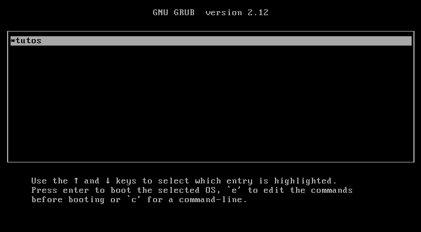

# Bare Bones 32 bit Kernel Hello World

## Overview

To complete this tutorial i followed along with the [osdev bare bones tutorial](https://wiki.osdev.org/Bare_Bones).

No changes to the files have been made instead I just followed along, I will update my experience following through more tutorials learning more about operating systems bare bones.

## Bare Bones

Steps to compile and run this code on linux systems. (Tested on wsl2-ubuntu-24.04)

- **Step 1:** Download the cross compiler as helpfully provided by github user `lordmilko`
```bash
wget https://github.com/lordmilko/i686-elf-tools/releases/download/7.1.0/i686-elf-tools-linux.zip
```

- **Step 2:** Install from the package manager the other utilities
```bash
sudo apt install -y grub-pc-bin qemu-system-x86
```
*Note: grub-pc-bin is needed for the iso form otherwise what I believe to be a UEFI related error code will appear*

- **Step 3:** Compile the kernel and create the ISO
```bash
make
```

- **Step 4:** Run the kernel
```bash
qemu-system-i386 -cdrom tutos.iso
```
or
```bash
qemu-system-i386 -kernel tutos.bin
```
*Note: You should have wslg setup to see the window appearing. This feature I believe to be standard on Windows 11 wslg installs*

And the output will look something like this.


